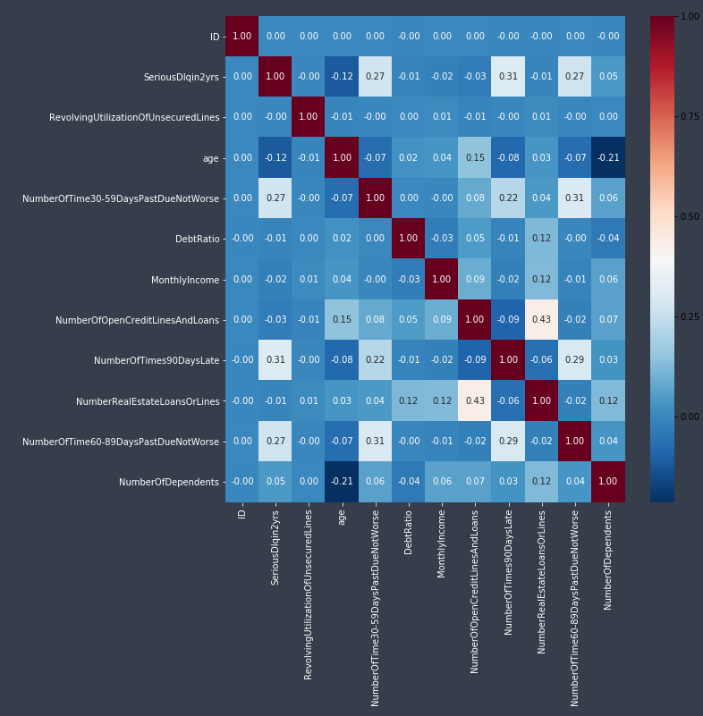
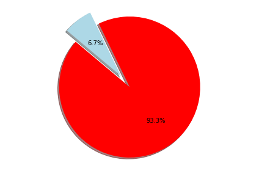
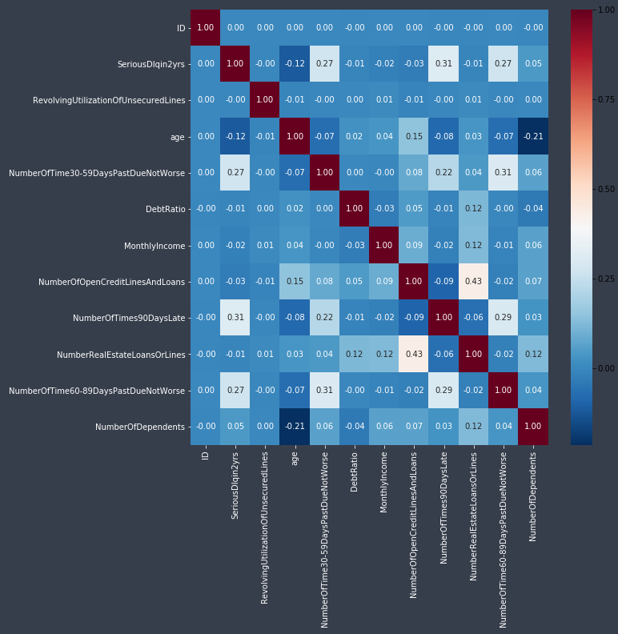
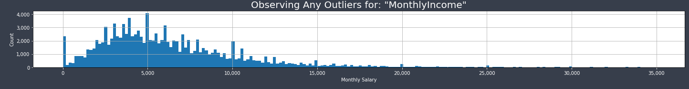
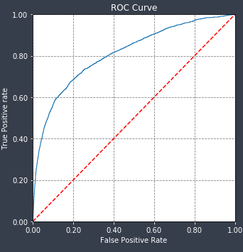

<h2>Kaggle-GiveMeSomeCredit</h2>
<h3>Description:</h3>
A brief look at the Give Me Some Credit dataset from Kaggle. 
Incorrect data was imputed and outliers removed. Subsequently a 2-fold cross validation was applied and various models were fitted such as Logistic Regression, Random Forest, XGBoost. Further an Ensemble and Stacking was tried.

<h3 id="System Objective">Introduction</h3>
The 3 month long contest from Kaggle called <a href="https://www.kaggle.com/c/GiveMeSomeCredit/overview/description">Give Me Some Credit (GMSC)</a> involves predicting the probability that a person within 2 years did not repay an installment paying in 90 days or more beyond the due date. 
There are 11 bits of historical data with about 250,000 anonymous borrower information occupying 15MB and 5MB compressed hard drive space. The dataset is split into 150,000 examples (labeled training set - with 10,026 positive and 139,974 negative elements) and testing rows of 101,503. The following table summarises the numeric dataset with one predictor variable called <em>SeriousDlqin2yrs</em> and 10 explanatory variables (features).
        
<table>
<thead><tr><th>Variable Name</th><th>Description</th><th>Data Type</th></tr></thead><tbody>
 <tr><td>SeriousDlqin2yrs</td><td>Person experienced 90 days past due delinquency or worse.</td><td>Y/N</td></tr>
 <tr><td>RevolvingUtilizationOfUnsecuredLines</td><td>Total balance on credit cards and personal lines of credit except real estate and no installment debt like car loans divided by the sum of credit limits.</td><td>percentage</td></tr>
 <tr><td>Age</td><td>Age of borrower in years.</td><td>integer</td></tr>
 <tr><td>NumberOfTime30-59DaysPastDueNotWorse</td><td>Number of times borrower has been 30-59 days past due but no worse in the last 2 years.</td><td>integer</td></tr>
 <tr><td>DebtRatio</td><td>Monthly debt payments, alimony,living costs divided by monthy gross income.</td><td>percentage</td></tr>
 <tr><td>MonthlyIncome</td><td>Monthly income.</td><td>real</td></tr>
 <tr><td>NumberOfOpenCreditLinesAndLoans</td><td>Number of Open loans (installment like car loan or mortgage) and Lines of credit (e.g. credit cards).</td><td>integer</td></tr>
 <tr><td>NumberOfTimes90DaysLate</td><td>Number of times borrower has been 90 days or more past due.</td><td>integer</td></tr>
 <tr><td>NumberRealEstateLoansOrLines</td><td>Number of mortgage and real estate loans including home equity lines of credit.</td><td>integer</td></tr>
 <tr><td>NumberOfTime60-89DaysPastDueNotWorse</td><td>Number of times borrower has been 60-89 days past due but no worse in the last 2 years.</td><td>integer</td></tr>
 <tr><td>NumberOfDependents</td><td>Number of dependents in family excluding themselves (spouse, children etc.).</td><td>integer</td></tr>
</tbody></table>

Since the class labels are provided for the sole response variable SeriousDlqin2yrs taking values 0 (NO default) or 1 (default). Supervised Learning classification models are a natural initial approach such as logistic regression as the base model and to improve with an ensemble of two-class boosted decision tree and stacking techniques involving Neural Networks.

<h3>Exploratory Data Analysis</h3>

Summary descriptive statistics of the features.

<table>
<thead><th></th><th>SeriousDlqin2yrs</th><th>RevolvingUtilizationOfUnsecuredLines</th><th>age</th><th>NumberOfTime30-59DaysPastDueNotWorse</th><th>DebtRatio</th><th>MonthlyIncome</th><th>NumberOfOpenCreditLinesAndLoans</th><th>NumberOfTimes90DaysLate</th><th>NumberRealEstateLoansOrLines</th><th>NumberOfTime60-89DaysPastDueNotWorse</th><th>NumberOfDependents</th></tr></thead><tbody>
 <tr><td>count</td><td> 150,000.00 </td><td> 150,000.00 </td><td> 150,000.00 </td><td> 150,000.00 </td><td> 150,000.00 </td><td> 120,269.00 </td><td> 150,000.00 </td><td> 150,000.00 </td><td> 150,000.00 </td><td> 150,000.00 </td><td> 146,076.00 </td></tr>
 <tr><td>mean</td><td> 0.07 </td><td> 6.05 </td><td> 52.30 </td><td> 0.42 </td><td> 353.01 </td><td> 6,670.22 </td><td> 8.45 </td><td> 0.27 </td><td> 1.02 </td><td> 0.24 </td><td> 0.76 </td></tr>
 <tr><td>std</td><td> 0.25 </td><td> 249.76 </td><td> 14.77 </td><td> 4.19 </td><td> 2,037.82 </td><td> 14,384.67 </td><td> 5.15 </td><td> 4.17 </td><td> 1.13 </td><td> 4.16 </td><td> 1.12 </td></tr>
 <tr><td>min</td><td> -   </td><td> -   </td><td> -   </td><td> -   </td><td> -   </td><td> -   </td><td> -   </td><td> -   </td><td> -   </td><td> -   </td><td> -   </td></tr>
 <tr><td>25%</td><td> -   </td><td> 0.03 </td><td> 41.00 </td><td> -   </td><td> 0.18 </td><td> 3,400.00 </td><td> 5.00 </td><td> -   </td><td> -   </td><td> -   </td><td> -   </td></tr>
 <tr><td>50%</td><td> -   </td><td> 0.15 </td><td> 52.00 </td><td> -   </td><td> 0.37 </td><td> 5,400.00 </td><td> 8.00 </td><td> -   </td><td> 1.00 </td><td> -   </td><td> -   </td></tr>
 <tr><td>75%</td><td> -   </td><td> 0.56 </td><td> 63.00 </td><td> -   </td><td> 0.87 </td><td> 8,249.00 </td><td> 11.00 </td><td> -   </td><td> 2.00 </td><td> -   </td><td> 1.00 </td></tr>
 <tr><td>max</td><td> 1.00 </td><td> 50,708.00 </td><td> 109.00 </td><td> 98.00 </td><td> 329,664.00 </td><td> 3,008,750.00 </td><td> 58.00 </td><td> 98.00 </td><td> 54.00 </td><td> 98.00 </td><td> 20.00 </td></tr>
</tbody></table>

To examine feature reduction, the following showsn a correlation heatmap of the original data. Red implies values are correlated.

<figure style="float:left">
	
</figure>

				
				
The variable <strong>SeriousDlqin2yrs</strong> is labelled either 0's and 1's with no other values. The class imbalance is 6.7% (ratio of 1:14) as shown be the following pie chart. As this dominance of 0's could dominate the prediction. Replicating the number of 1's 14 times was also tried to determine if evening the dataset provided some value.

<figure style="float:left">
		
</figure>

 For the <strong>age</strong> variable, it can be believed that the minimum age should start at 21 as there is only one value below this with an age of 0. This value can be adjusted to take the average value of the distribution.
For the variables "NumberOfTime30-59DaysPastDueNotWorse", two years divided into 60 day increments suggests a maximum value of about 12-24 and this is what the data set exhibits except for a cluter of points at the values of 96 and 98. These are either strange mistakes or possibly values specific to the dataset with some other meaning such as 'unknown'. Further, the variables "NumberOfTimes90DaysLate" and "NumberOfTime60-89DaysPastDueNotWorse" also contained these 96 and 98 pillars of data which showed up on correlation between the three variables. To accomodate for this, the values were considered to be Winsorized to the previous largest value but the median value was chosen with the aim to have less impact over the sample distribution.
After altering the values for 96 and 98. The significant inter-correlation variables "NumberOfTime30-59DaysPastDueNotWorse", "NumberOfTimes90DaysLate" and "NumberOfTime60-89DaysPastDueNotWorse" drops away.

<figure style="float:left">
		
</figure>

The feature <strong>MonthlyIncome</strong> has 29,731 missing values or 19.8% of 150,000 examples with the belly of the distribution around 5,000 and a long right-tail.

	<figure style="float:left">
							
	</figure>
	

				
NumberOfDependents had 3924	missing values or 2.6% of the dataset. These values were set to zero. There is a jump from 6 to 20 dependents with 244 examples in that 99.9% percentile bin. All values were nominal whole numbers such that there were no fraction of a dependent.

<h3>Model Estimations</h3>
Split the training data into 2-fold Cross Validation with 75% random samples in training the remaining for validation/test. Logistic regression can be considered the base model to compare others to. Out-of-sample fit on unseen data gave an AUC of 0.8117. With the following ROC curve.

	<figure style="float:left">
							
	</figure>
	

<h3>Conclusions</h3>
Given from 150,000 sample a population estimation of credit default is 6.7%. If the average loan size is US$1,000 per customer. Per 100,000 customers, assuming the amount if fully unrecoverable this can equate to a full potential loss of US$6.7mn. Being able to predict from the onset and existing customers default probabilities accurately clearly directly impact a loan firms bottom line. Even a 50% increase in default estimation efficiency from 6.7% to 3.35% results in a US$3.35mn loss. The implementation is more likely to be on reduction of loan amount size depending on probability of default. As not to turn customers away. Further, can generate revenues before a default occurs. 
A model used in this anlaysis can be used in an online credit-line approval process as well as provided to product and client relationship managers to detect ongoing potential credit threats.

<h3>Future Analysis</h3>
The extreme examples may be the ones which default more and this extreme distribution may be worth estimating separately to the rest of the distributions.

<h3>Requirements</h3>
 
<a href="https://www.python.org/">Python (>3.4)</a>, <a href="https://jupyter.org/">jupyter</a> and <a href="https://scikit-learn.org/">SciKitLearn</a>.

 
 
